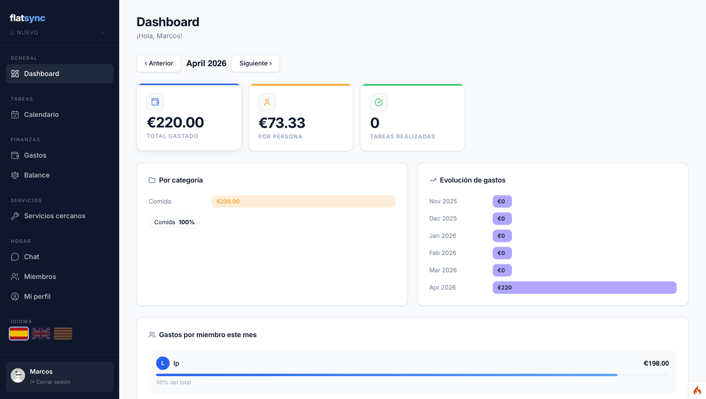
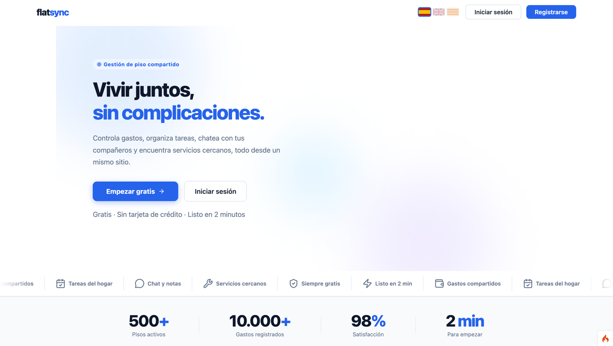
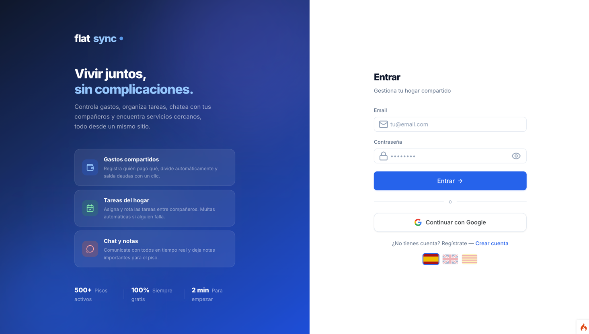
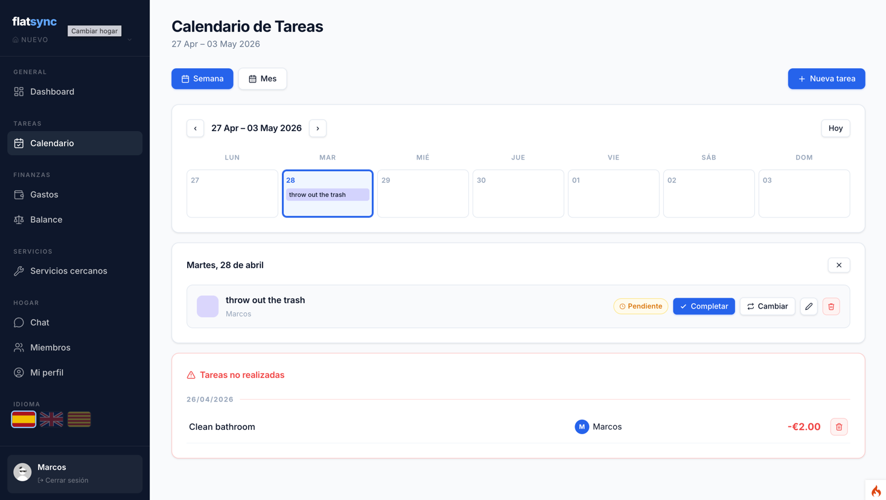
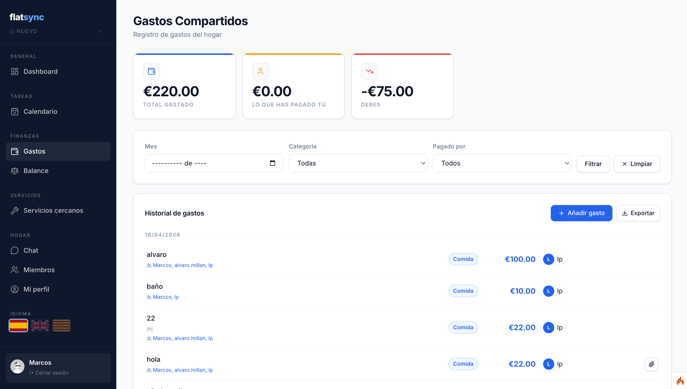

# FlatSync

Aplicación web para la gestión de pisos compartidos. Permite a los compañeros de piso organizar tareas del hogar, gastos compartidos, miembros y comunicación en un solo lugar.



---

## Características

- **Hogares** — Crea tu piso o únete a uno con código de invitación. Soporte multi-hogar por usuario.
- **Tareas** — Gestión de tareas del hogar con calendario semanal/mensual, asignación por miembro e intercambio de turnos.
- **Gastos** — Control de gastos compartidos, balance por usuario y liquidación de deudas.
- **Chat** — Mensajería interna entre los miembros del piso.
- **Servicios** — Seguimiento de servicios y suministros del hogar.
- **Miembros** — Gestión de compañeros con roles (administrador / miembro).
- **Perfil** — Edición de datos personales y preferencias.

---

## Stack tecnológico

| Capa | Tecnología |
|---|---|
| Backend | PHP 8 · CodeIgniter 4 |
| Base de datos | MySQL 8 |
| Servidor web | Nginx |
| Entorno local | Docker / Docker Compose |
| Despliegue | Railway |

---

## Requisitos

- [Docker Desktop](https://www.docker.com/products/docker-desktop) (requiere cuenta en Docker Hub)
- [Git](https://git-scm.com/downloads)

---

## Instalación y puesta en marcha

```bash
# 1. Clona el repositorio
git clone <url-del-repo>
cd FlatSync

# 2. Configura las variables de entorno
cp .env.example .env   # edita el archivo con tus valores
```

En el `.env` ajusta al menos:

| Variable | Descripción |
|---|---|
| `PROJECT_PREFIX` / `PROJECT_NAME` | Prefijo de los contenedores Docker |
| `MYSQL_*` | Credenciales de la base de datos |
| `NGINX_PORT` | Puerto local para acceder a la app |
| `PHPMYADMIN_PORT` | Puerto local de phpMyAdmin |

```bash
# 3. Levanta los contenedores
docker compose up -d
```

La primera vez tardará un poco porque descarga las imágenes de Docker Hub.

---

## Contenedores

| Contenedor | Descripción | Puerto por defecto |
|---|---|---|
| `app` | PHP-FPM (CodeIgniter 4) | 9000 (interno) |
| `mysql` | Base de datos MySQL | `MYSQL_PORT`:3306 |
| `nginx` | Servidor web | `NGINX_PORT`:8080 |
| `phpmyadmin` | Administrador de BD vía navegador | `PHPMYADMIN_PORT`:8081 |

Accede a la app en: [http://localhost:8080](http://localhost:8080)  
Accede a phpMyAdmin en: [http://localhost:8081](http://localhost:8081)

---

## Base de datos

El directorio `docker-compose/mysql/` contiene los archivos `.sql` que se importan automáticamente al levantar los contenedores por primera vez:

| Archivo | Contenido |
|---|---|
| `002-table.sql` | Tablas base (usuarios, etc.) |
| `003-user-homes.sql` | Tabla pivot `user_homes` |

Para acceder manualmente a la BD dentro del contenedor:

```bash
docker exec -it <nombre_contenedor_mysql> bash
mysql -u root -p
```

---

## Comandos útiles

```bash
# Ver estado de los contenedores
docker compose ps

# Detener los contenedores
docker compose down

# Gestionar dependencias PHP con Composer
docker compose exec app composer install
docker compose exec app composer update

# Ejecutar migraciones de CodeIgniter
docker compose exec app php spark migrate
```

---

## Estructura del proyecto

```
FlatSync/
├── docker-compose/         # Configuración de Nginx, MySQL, Xdebug y PHP
├── www/
│   ├── app/
│   │   ├── Controllers/    # AuthController, ChoresController, ExpensesController…
│   │   ├── Models/         # ChoreModel, ExpenseModel, HomeModel…
│   │   └── Views/          # Vistas por sección (chores, expenses, homes…)
│   ├── public/             # Punto de entrada (index.php) y assets
│   └── writable/           # Logs, caché y sesiones
├── docker-compose.yaml
├── Dockerfile
└── .env
```

---

## Capturas de pantalla


Landing



Sing-in



Calendar



Expenses



---

## Extensiones PHP incluidas

`pdo_mysql` · `mbstring` · `exif` · `pcntl` · `bcmath` · `gd` · `zip` · `intl` · `mysqli` · `xdebug` · `wkhtmltopdf`

Para añadir más, edita el `Dockerfile` en la raíz del proyecto.

---

## Despliegue en Railway

El proyecto incluye `railway.json` y `Dockerfile.production` listos para desplegar en [Railway](https://railway.app). Configura las variables de entorno equivalentes a las del `.env` local desde el panel de Railway.
